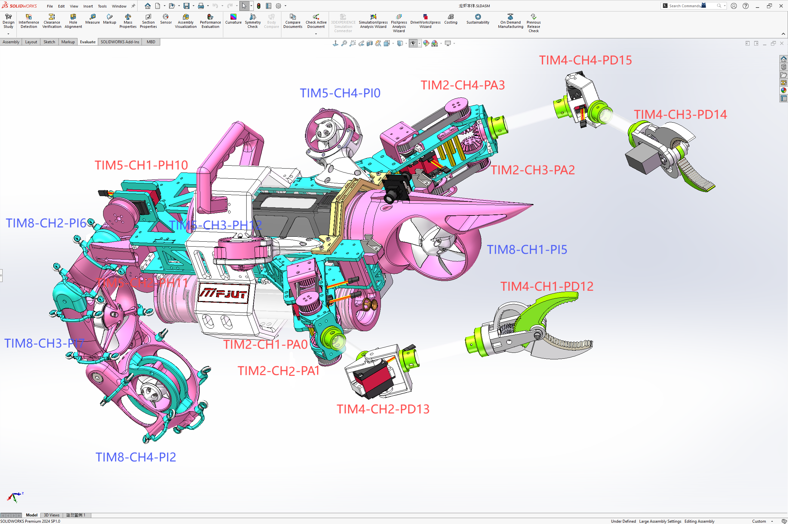
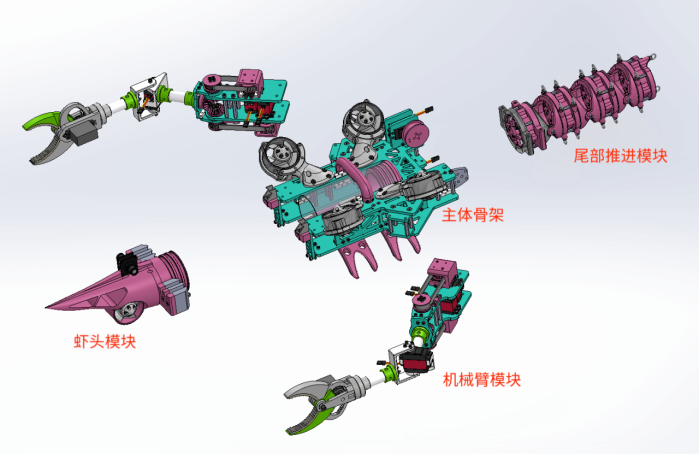
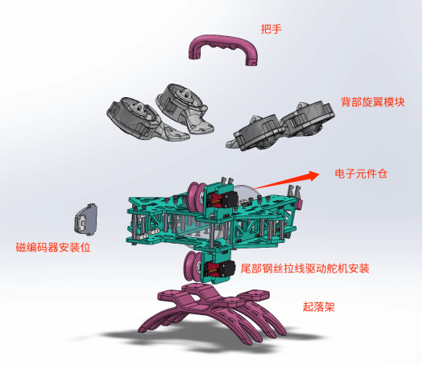
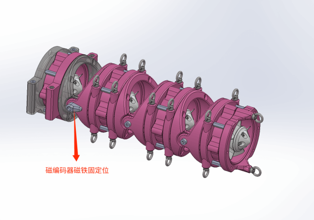
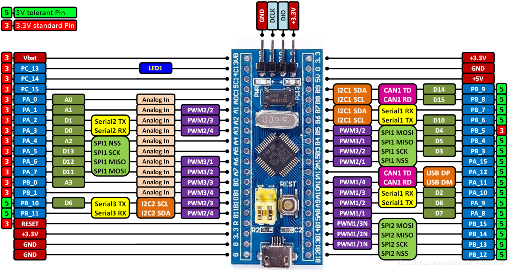

# BionicLobster-ROV

<p align="center">
  <a href="./README.md">Simplified Chinese</a> · <a href="./README.en.md">English</a> · <a href="https://github.com/iowqi/ShrimpROV">Open-source Mechanical Project</a> · <a href="https://github.com/zhizhizzzzzzz/OceanSphere">Open-source Vision / Perception Project</a>
</p>

<p align="center">
  
</p>

<p align="center">
  <strong>Dual-board STM32 firmware for a biomimetic lobster underwater robot</strong><br/>
  Covers actuator control, sensor acquisition, inter-board communication, and dorsal quad-motor stabilization.
</p>

## At A Glance

| Item | Details |
| --- | --- |
| Controller architecture | Dual `STM32F103C8` |
| Firmware split | `firmware` main-board firmware / `firmware_quad` propulsion and quad-stabilization coprocessor firmware |
| Language and stack | C + STM32 Standard Peripheral Library |
| Build flow | CMake + local ARM GCC toolchain |
| Flash flow | `DAPLink (CMSIS-DAP)` + OpenOCD |
| Repository scope | Low-level embedded control only, with vision and autonomy kept in separate projects |

> The repository scripts prefer a repo-local toolchain under `.tools/`, which makes the Linux build and flashing workflow easier to reproduce across machines.

## Control Architecture

| Firmware | Board role | Responsibilities | Key peripherals |
| --- | --- | --- | --- |
| `firmware` | Main control board | Manipulators, claws, tail servos, pressure and angle sensing, remote/host communication, and command dispatch to the coprocessor | 6x `AS5600`, `MS5837`, `USART1`, `USART2` |
| `firmware_quad` | Propulsion and stabilization coprocessor | Head thruster, tail thrusters, dorsal quad motors, attitude processing, and lightweight closed-loop control | `JY901S`, `USART1`, `USART2` |

Main-board actuators:

- 2 elbow 180-degree servos
- 2 claw servos
- 4 arm continuous-rotation servos
- 2 tail servos

Coprocessor actuators:

- 1 head thruster
- 4 tail thrusters
- 4 dorsal quad motors

## Quick Start

### 1. Set up the local toolchain

```bash
./scripts/setup-local-toolchain.sh
```

If you only want the ARM compiler first:

```bash
./scripts/setup-local-toolchain.sh --arm-only
```

### 2. Build both firmware targets

```bash
./scripts/build.sh
```

Artifacts are written to `build/`:

| File | Description |
| --- | --- |
| `build/firmware.elf` | Main-board debug image |
| `build/firmware.hex` | Main-board flash image |
| `build/firmware.bin` | Main-board raw binary |
| `build/firmware_quad.elf` | Coprocessor debug image |
| `build/firmware_quad.hex` | Coprocessor flash image |
| `build/firmware_quad.bin` | Coprocessor raw binary |

### 3. Flash

Flash the main board:

```bash
./scripts/flash.sh build/firmware.elf
```

Flash the propulsion / quad board:

```bash
./scripts/flash.sh build/firmware_quad.elf
```

### 4. Optional: load the environment into your current shell

```bash
source ./scripts/env.sh
```

Notes:

- `build.sh` automatically installs the local ARM compiler if it is missing.
- `flash.sh` automatically triggers a build if the requested `ELF` does not exist yet.
- `CMakePresets.json` is included for newer CMake versions.
- The default flashing path assumes `DAPLink (CMSIS-DAP)` plus OpenOCD.

## Repository Layout

| Path | Description |
| --- | --- |
| `firmware/` | Main-board firmware sources |
| `firmware_quad/` | Propulsion / quad-stabilization coprocessor sources |
| `scripts/` | Toolchain setup, build, flash, and debug helpers |
| `cmake/` | ARM GCC toolchain configuration |
| `openocd/` | OpenOCD interface and target configuration |
| `ld/` | STM32 linker scripts |
| `Images/` | Project photos and reference figures |

## Firmware Status

- The main board already exposes six named `AS5600` channels.
- The coprocessor includes a lightweight closed-loop flight controller using `JY901S` angle and gyro data for `roll/pitch` stabilization, `yaw` hold, command slew limiting, and IMU failover.
- This repository is focused on low-level control, while higher-level autonomy and vision stay in separate repositories.

<details>
  <summary>Expand to view the six <code>AS5600</code> channel names</summary>

  - `left_arm_upper_360`
  - `left_arm_lower_360`
  - `right_arm_upper_360`
  - `right_arm_lower_360`
  - `tail_servo1`
  - `tail_servo2`
</details>

## Credits And Related Projects

- Mechanical platform: `真甲咒`, `小白`
- Vision / perception: `大道寺知世`
- Mechanical open-source project: <https://github.com/iowqi/ShrimpROV>
- Vision / perception open-source project: <https://github.com/zhizhizzzzzzz/OceanSphere>

## Media

<p align="center">
  
  
  
</p>

<p align="center">
  
</p>

## License

This project is released under the [MIT License](./LICENSE).
